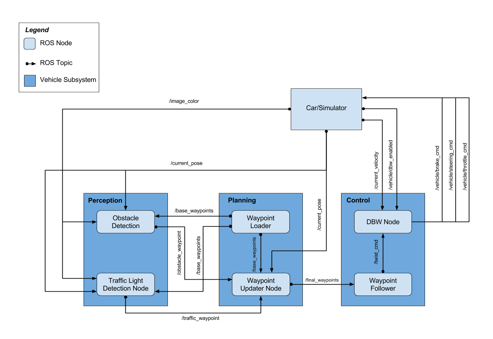
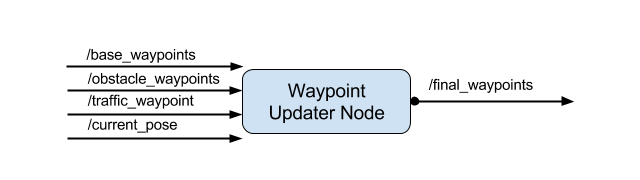
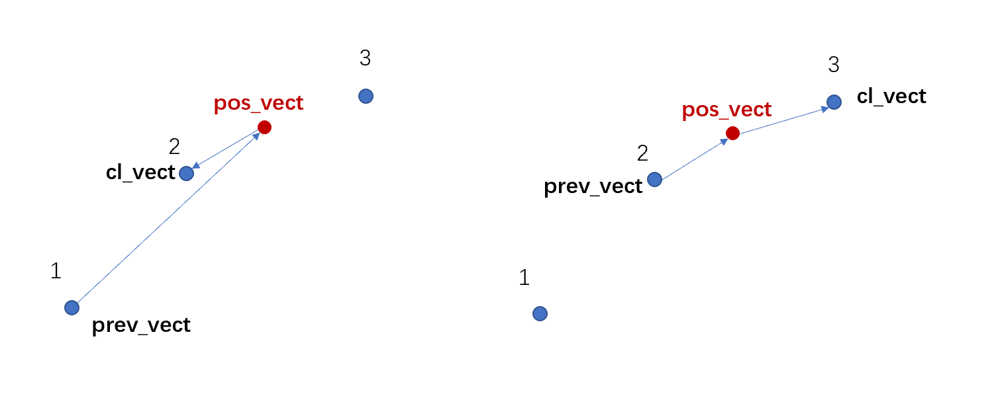
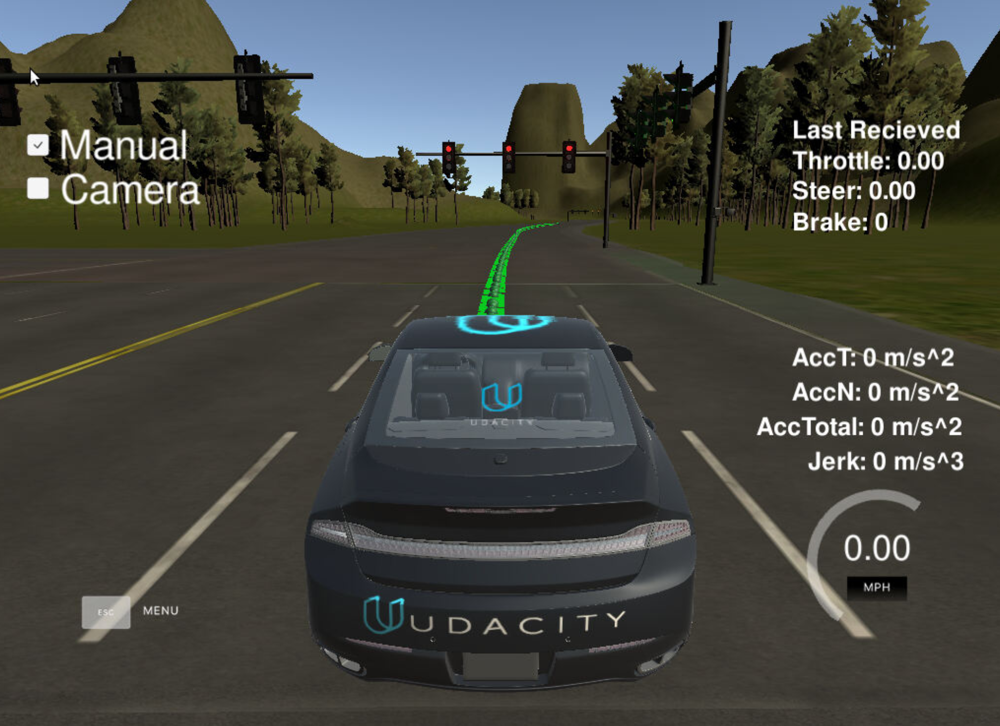
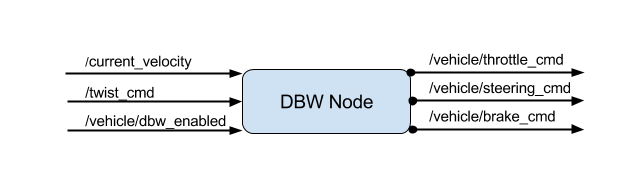
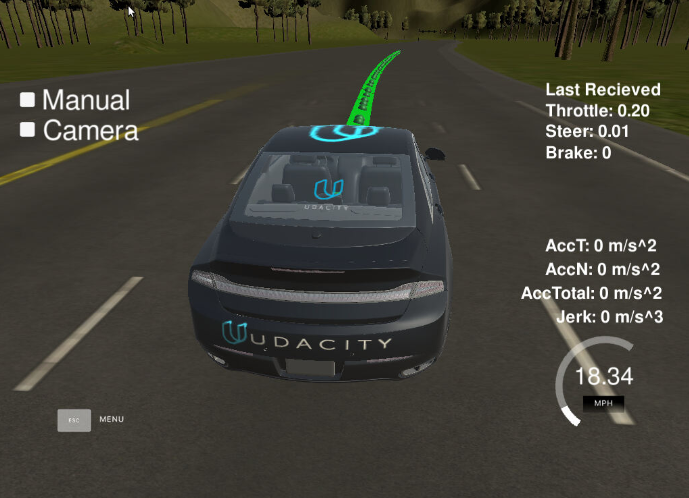
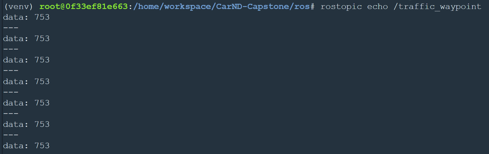
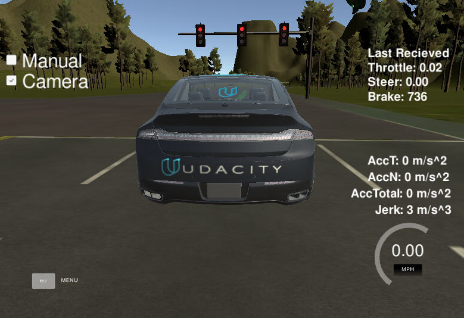

# 项目概述

本项目是Udacity自动驾驶课程的最后一个项目，通过ROS系统将感知、规划和执行模块连接在一起，并在Udacity提供的模拟器中完成自动驾驶任务。

# 准备

## 开发环境

1. ROS系统：为了使用ROS系统，需要通过虚拟机中的LINUX系统安装，Udacity已经提高了完整的[虚拟机安装包](https://s3-us-west-1.amazonaws.com/udacity-selfdrivingcar/Udacity_VM_Base_V1.0.0.zip "点击下载")，并且配置好了所需要的环境（登录密码为 `udacity-nd`）。为了方便虚拟机和本地系统的通信，还可以下载[VirtualBox](https://www.virtualbox.org/wiki/Downloads)。
2. 模拟器：模拟器内置了一台自动驾驶汽车，可以通过ROS系统进行操作。其中ROS系统运行在虚拟机中，[模拟器](https://github.com/udacity/CarND-Capstone/releases)运行在Windows环境下，二者通过电脑端口进行通信。通信的方法参见 [Port Forwarding.pdf](Port+Forwarding.pdf)。
3. 另外，在项目源代码中包含了对交通信号灯进行训练所需的[训练集](https://s3-us-west-1.amazonaws.com/udacity-selfdrivingcar/traffic_light_bag_file.zip)。

进入虚拟机后需要先安装python所需要的库文件，相关库在 [requirements.txt](requirements.txt) 中，可以进入本项目文件夹后通过以下命令一次性获取：

```
pip install -r requirements.txt
```

> Udacity提供的VM镜像里的pip版本太旧了，安装库时可能出错，可以用下面的命令行先更新pip

```
curl https://bootstrap.pypa.io/pip/2.7/get-pip.py -o get-pip.py
sudo python2 get-pip.py
```

## ROS的基本操作

在完成部分代码后，可以在ROS中进行测试，编译和运行ROS代码的命令如下：

```
cd ros
catkin_make
source devel/setup.sh
roslaunch launch/styx.launch
```

之后打开模拟器即可。

其他ROS相关的命令如下表（待补充）：

| 功能描述          | 命令行                                                 | 输出 |
| ----------------- | ------------------------------------------------------ | ---- |
| 开启主线程        | roscore                                                |      |
| 开启节点          | rosrun /node_name                                      |      |
| 查看 node 列表   | rosnode list                                           |      |
| 查看 topic 列表   | rostopic list                                          |      |
| 查看 msg 列表     | rosmsg list                                            |      |
| 查看 topic 信息   | rostopic info /topic_name                              |      |
| 查看 msg 信息     | rosmsg info /msg_type<br />rosed msg_name/msg_type.msg |      |
| 查看实时 msg 内容 | rostopic echo /topic_name                              |      |

在 python 中进行 subscriber 和 publisher 定义的参考代码如下：

```python
pub = rospy.Publisher('/topic_name', msg_datatype, queue_size)
msg.header = header
msg.msg_type = data
pub.publish(msg)

rospy.Subscriber('/topic_name', msg_datatype, func_name)
```

## 项目计算图形

整个项目的架构如下图：



# Waypoint Updater Node - I

为了让车辆再模拟器中先运动起来，首先需要写下第一个版本的waypoint updater节点。此节点的计算图形如下：



python文件在 ` ros\src\waypoint_updater\waypoint_updater.py`，可[点击这里打开](ros\src\waypoint_updater\waypoint_updater.py)

这个节点最终目的是：**发布** **固定数量**的在车辆**前方**的 waypoint，每个waypoint需要包含考虑遇到**红绿灯**和**障碍物**时的情况正确的**目标速度**target velocity。

第一版可以暂时不用考虑交通灯和障碍物等的影响。完成后在模拟器中可以看到车辆前方有一串绿色路径点即可。后续完成了dbw(线控)的节点后，可以根据实际情况在更新本节点。

## 相关 Topic

需要 subscribe 的 topic 有：

* /base_waypoints  ：包含了道路上所有的基础 waypoints，只发布一次
* /current_pose  ：  当前车辆的姿态

需要 publish 的 topic 有：

* `/final_waypoints`

## Message 描述

在 `waypoint_updater.py` 中可以看出 `/base_waypoints` 和 `/final_waypoints` 传递的message 的类型是：

 `Lane`

关于 message 的描述可以在 `ros\src\styx_msgs\msg\Lane.msg` 里[查看](ros\src\styx_msgs\msg\Lane.msg)。包含了一个 `header` 和 数据类型为 `Waypoints` 的列表 ` waypoint[]`。更详细的信息也可以在命令行中用 ：

* `$ rostopic info /final_waypoints` 查看 topic 信息
* `$ rosmsg info styx_msgs/Lane` 查看 message 信息

`Lane `类型的 message 的信息如下：

```
std_msgs/Header header
  uint32 seq
  time stamp
  string frame_id
styx_msgs/Waypoint[] waypoints
  geometry_msgs/PoseStamped pose
    std_msgs/Header header
      uint32 seq
      time stamp
      string frame_id
    geometry_msgs/Pose pose
      geometry_msgs/Point position
        float64 x
        float64 y
        float64 z
      geometry_msgs/Quaternion orientation
        float64 x
        float64 y
        float64 z
        float64 w
  geometry_msgs/TwistStamped twist
    std_msgs/Header header
      uint32 seq
      time stamp
      string frame_id
    geometry_msgs/Twist twist
      geometry_msgs/Vector3 linear
        float64 x
        float64 y
        float64 z
      geometry_msgs/Vector3 angular
        float64 x
        float64 y
        float64 z
```

可以看到除了 header 以外，还有一个 waypoint[] 的列表，别表中的每一个元素包含 pose 和 twist，pose 和 twist 下各自还有多个层级。如需获得 position 中的 x 坐标，可以用如下代码：

```
my_lane_msg[0]. pose.pose.position.x
```

如需获得x方向的速度信息，可以使用如下代码：

```
my_lane_msg[0].twist.twits.linear.x
```

## Topics 和 Msg 一览

| Topic            | Msg Type                  | 备注                                               |
| ---------------- | ------------------------- | -------------------------------------------------- |
| /base_waypoints  | styx_msgs/Lane            | 由 static.csv 文件获取                             |
| /current_pose    | geometry_msgs/PoseStamped | 车辆当前的位置和速度，由模拟器或定位模块获取       |
| /final_waypoints | styx_msgs/Lane            | 是/base_waypoints的一部分，在车前方离车最近的N个点 |

## 代码实现

### `pose_cb()` 和 `waypoints_cb()`

首先需完成两个 callback 函数，分别用于暂存 pose 信息和 waypoint 信息：

* 其中在 `waypoints_cb()` 中，先需要将所有 waypoints 赋值给 `base_waypoints`，作为完整的 waypoints 集；
* 此外，需要将原本 waupoints 里的 x, y 坐标信息提取出来，赋值给 `waypoints_2d`；

  ```python
  self.waypoints_2d = [[waypoint.pose.pose.position.x,waypoint.pose.pose.position.y] for waypoint in waypoints.waypoints]
  ```
* 同时，为了方便后续能找到在当前位置前的 waypoints，需要使用 `scipy `库里的 `KDTree `数据结构。

  ```python
  self.waypoints_tree = KDTree(self.waypoints_2d)
  ```

> KDTree是一个k维的树形数据结构，主要用于在多维空间的数据搜索

### `get_closest_waypoint_idx()`

在获取最近的 waypoint 时，我们希望得到的点是在车辆前方的，可以通过构建一些 hyperparameter 来实现，下图时通过**向量的点积**来判断最近点在是否在当前位置前方。

首先需要获取离当前位置 **[x,y]** 最近的 **1** 个点的**索引**，可是使用 `scipy.spatial` 库里 `KDTree `中的 `query()` 函数来获取，部分参考代码为：

```python
#get closest waypoint index using waypoints_tree
closest_idx = self.waypoints_tree.query([x,y],1)[1]
closest_coord = self.waypoints_2d[closest_idx]
```

当最近点在当前位置后方时，从“当前点指向最近点的向量 ` pos_vect - cl_vect`”与“前一个点到当前点的向量 `pos_vect - prev_vect`”方向相反，既**点积为负**，如下图所示。



部分参考代码如下：

```python
prev_coord = self.waypoints_2d[closest_idx-1]

#creat vectors to check is the waypoints in front of or behind current pose
cl_vect = np.array(closest_coord) # closest waypoint vector
prev_vect = np.array(prev_coord) # previous waypoint vector
pos_vect = np.array([x,y]) # current pose vector

# dot product > 0, means this waypoint is behind the current pose, then check next one
val = np.dot(cl_vect - prev_vect, pos_vect - cl_vect)
if val>0:
    closest_idx = (closest_idx + 1) % len(self.waypoints_2d)
```

### `publish_waypoints()`

在__init__(self) 函数中定义 Publisher() 函数。后再 publish_waypoints() 函数中建立 lane 信息类型，并把 waypoints 传递给 lane，最后通过将传入发布函数完成发布，参数的传递路径如下：

**header, waypoints -> lane -> final_waypoints_pub()**

> 其中 `header `与 `base_waypoints `相同
>
> waypoints为在 `base_waypoints`中，从最近的点开始，数量为 `LOOKAHEAD_WP`的切片

参考代码如下：

```python
def __init__(self):
    ...
    self.final_waypoints_pub = rospy.Publisher('final_waypoints', Lane, queue_size=1)
    ...

def publish_waypoints(self, closest_idx):
        lane = Lane()
        lane.header = self.base_waypoints.header
        lane.waypoints = self.base_waypoints.waypoints[closest_idx:closest_idx + LOOKAHEAD_WPS]
        self.final_waypoints_pub.publish(lane)
```

## 初步测试

完成简单的waypoints的发布后，可以在模拟器中进行测试，这时候就可以看到 waypoints 已经被发布了，显示成绿色的小球：



# DBW Node

完成了获得 waypoint 后，接下来需要实现让车辆跟着waypoint运动，这需要完成通过 DBW 节点。DBW 是 Drive By Wire 的简写，意思是线控驾驶，是通过电控的方式，控制车辆的转向、油门、制动等。

## 相关 Topic

DBW 节点需要从 subscribe \twist_cmd 的 topic（由 waypoints_follower 节点 publish 自动完成），以获得车辆的目标位置、速度等信息，后将响应的操作指令 publish 以下 topic：

* /vehicle/throttle
* /vehicle/brake_cmd
* /vehicle/steering_cmd

> 此外，在测试阶段时，车辆通常配有安全员。当安全员介入车辆控制后，PID 等控制器应该停止累积误差，因此需要注意 DBW 是否正在工作

本节点相关的 topic 关系如下图：



## 相关源文件

DBW 节点涉及多个 .py 文件，主体部分在 dbw_node.py 中，其中可能需要应用到以下文件：

| 文件名                 | 说明                                                                               |
| ---------------------- | ---------------------------------------------------------------------------------- |
| dbw_node.py            | 配置节点的 subscriber 和 publisher，关系如上图                                     |
| > twist_controller.py | 包含 Controller 类，用于控制车辆                                                   |
| >> yaw_controller.py   | 可以用在 twist_controller 中的角度控制器，将线性和角度信息转化为**转向命令** |
| >> pid.py              | 可以用在 twist_controller 中的 PID 控制器                                          |
| >> lowpass.py          | 可以用在 twist_controller 中的 low pass 过滤器                                     |
| dbw_test.py            | 用于测试 DBW 节点                                                                  |

## 代码实现

### `dbw_node.py`

在__init__()函数中，先定义所需的变量并实例化所需函数。

首先根据本节点的计算图形定义 subscriber 和 publisher：

```python
self.steer_pub = rospy.Publisher('/vehicle/steering_cmd', SteeringCmd, queue_size=1)
self.throttle_pub = rospy.Publisher('/vehicle/throttle_cmd', ThrottleCmd, queue_size=1)
self.brake_pub = rospy.Publisher('/vehicle/brake_cmd', BrakeCmd, queue_size=1)
```

```python
rospy.Subscriber('/vehicle/dbw_enabled', Bool, self.dbw_enabled_cb)
rospy.Subscriber('/twist_cmd', TwistStamped, self.twist_cb)
rospy.Subscriber('/current_velocity', TwistStamped, self.velocity_cb)
```

### `twist_controller.py`

定义两个 controller，分别为

* yaw_controller()， 用于控制**转向**
* pid_controller()，用于控制**速度**（含油门和制动）

```python
self.yaw_controller = YawController(wheel_base, steer_ratio, 0.1, max_lat_accel, max_steer_angle)
self.throttle_controller = PID(kp,ki,kd,mn,mx)
```

对于转向控制，代码相对简单，只需要获取当前车速以及waypoint的线速度和角速度，使用yaw_controller()函数即可返回所需的转向值：

```python
current_vel = self.vel_lpf.filt(current_vel)
steering = self.yaw_controller.get_steering(linear_vel, angular_vel, current_vel)
```

> 其中当前速度可以使用 LowPassFilter() 将噪音去除

对于车速控制，使用PID控制：

```python
vel_error = linear_vel - current_vel
self.last_vel = current_vel

current_time = rospy.get_time()
sample_time = current_time - self.last_time
self.last_time = current_time

throttle = self.throttle_controller.step(vel_error, sample_time)
brake = 0

if linear_vel == 0 and current_vel < 0.1:
     throttle = 0
     brake = 700
elif throttle < .1 and vel_error < 0:
     throttle = 0
     decel = max(vel_error, self.decl_limit)
     brake = abs(decel)*self.vehicle_mass*self.wheel_radius
```

> 注意
>
> 1. 当waypoint的线速度为0（可能为红灯），而当前车速接近0时（可能怠速前进），需进行制动，保持车辆静止，使brake = 700 （Nm）
> 2. 当油门接近为0，但速度差为负时（目标waypoint速度小于当前车速），需要进行制动，以降速至目标速度，但减速不能大于车辆的极限
> 3. brake为制动力矩值，当只知道所需减速度时，需要根据车辆质量和车轮半径换算得到所需力矩

## 测试

完成此部分后，在模拟器中，车辆可以沿绿色 waypoint 行驶，完成转向



# Traffic Light Detection Node

为了让车辆在道路上能够按照交通灯进行停止和再次启动，需要完成 Traffic Light Detection Node。本节点会根据已知的路口**停车线**的位置，找到其对应的waypoint， 并获取当时**交通灯的状态**，最后将这两个信息发布给 waypoint updater 节点，用以调整 `waypoint `中的运动状态（如 `waypoint `的速度）。

## 相关 Topic

本节点除了获取完整的道路信息 /base_waypoints 以外，还需要获得 /image_color topic里的摄像机拍摄的图片信息，以及车辆当前位置 /current_pose。

最后输出 /traffic_waypoints 用于表示交通灯的位置以及状态。


如不使用深度学习进行交通灯检测的话，还需要 subscribe `'/vehicle/traffic_lights'` 的topic来直接获得交通灯的状态

```python
sub3 = rospy.Subscriber('/vehicle/traffic_lights', TrafficLightArray, self.traffic_cb)
```

## 代码实现

### `get_light_state()`

如不使用摄像头画面进行交通灯检测的话，`get_light_state() `只需要根据 ` '/vehicle/traffic_lights'` topic 在 `traffic_cb()`中获得即可。

```python
def traffic_cb(self, msg):
    self.lights = msg.lights
```

### `get_closest_waypoint()` 及 ` process_traffic_lights()`

为了找到离交通灯最近的 waypooint ，需要先建立 `get_closest_waypoint() `函数，用于获取离输入 waypoint 最近的 waypoint。同样也可以使用 KDTree 来完成，`waypionts_tree `在 `waypoints_cb()` 中获取即可：

```python
def get_closest_waypoint(self, x, y):
    closest_idx = self.waypoints_tree.query([x,y],1)[1] #don't care about whether is it before or behind  
    return closest_idx
```

之后便可以在 `process_traffic_lights()` 中通过 `get_closest_waypoint()`函数需要获取有交通灯的路口**离停车线**最近的那个 waypoint，用于标记车辆停车位置，以及到达时应该执行的状态（如红灯，则改waypoint的线速度应改为0）。**停车线**可以通过 `stop_line_positions = self.config['stop_line_positions']` 获得。之后建立循环，依次根据停车线 `stop_line_position[i]`找到离其最近的 waypoint。之后用这个位置 temp_wp_idex 与车辆位置 car_position 进行比对，找到最近的那个 `temp_wp_idx`， 即为所需要的**离车辆最近**的交通灯路口**停车线**的位置了：

```python
for i, light in enumerate(self.lights):
    line = stop_line_positions[i]
    #get the wp idx nearest to the light
    temp_wp_idx = self.get_closest_waypoint(line[0],line[1])

    #calculate the distance between the near light wp and current wp
    d = temp_wp_idx - car_position

    #update diff if d is smaller
    if d>=0 and d < diff:
        diff = d
        closest_light = light
        line_wp_idx = temp_wp_idx  
        #when iteration finished, closest light and line idx is got
```

## 测试

完成此部分代码后，可在模拟器中测试，并通过 `rostopic echo /traffic_waypoint`来实时监测 topic 发布的 msg 的内容：



# Waypoint Updater Node - II

完成了交通灯的识别后，就可以更新 waypoint updater 节点了。如果前方红绿灯显示为红灯，合理的操作应是逐渐减速，并在交通灯对应的停车线处停止车辆并保持到绿灯后，开始缓慢加速，通过路口并以目标速度继续形式。

## 代码实现

### decelerate_waypoints()

当遇到红灯时，需要将对应路口的waypoint的速度标为0，并且为了保持舒适性，在车辆位置和路口位置之间的waypoint 的速度应该依次变化。因此需要构建一个新的 waypoints 的序列，更新其中所有点的速度（为了不对原来的 waypoints 造成不可逆的改变，需建立一个新的 `temp `列表，来储存更改速度后的waypoints），来完成减速和停止的动作。

```python
 def decelerate_waypoints(self,waypoints,closest_idx):
     temp = []
     for i, wp in enumerate(waypoints):

         p = Waypoint()
         p.pose = wp.pose

         stop_idx = max(self.stopline_wp_idx - closest_idx - 2, 0)
         dist = self.distance(waypoints, i, stop_idx)
         vel = math.sqrt(2 * MAX_DECEL * dist)
         if vel < 1.0:
             vel = 0
  
         p.twist.twist.linear.x = min(vel, wp.twist.twist.linear.x)
         temp.append(p)

     return temp
```

其中，速度的变化可以是线性的也可以是非线性的，为了使得加加速度均匀变化，速度的变化采用非线性的形式，既通过距离和减速度的平方根来计算。

# 最终效果

最后，在车辆遇到路口时，将会逐渐减速指0，并通过制动，将车辆维持在禁止状态。绿灯后，车辆可以缓慢启动，并逐渐加速通过路口并达到指定车速



[演示视频](video/final.mp4)
